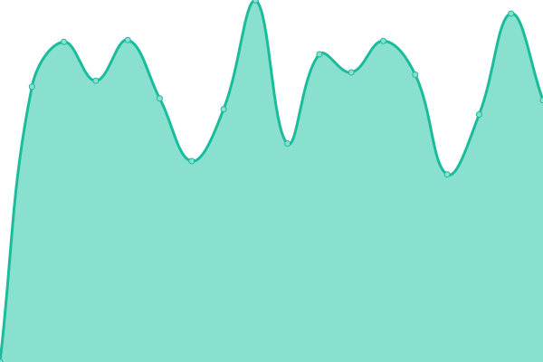
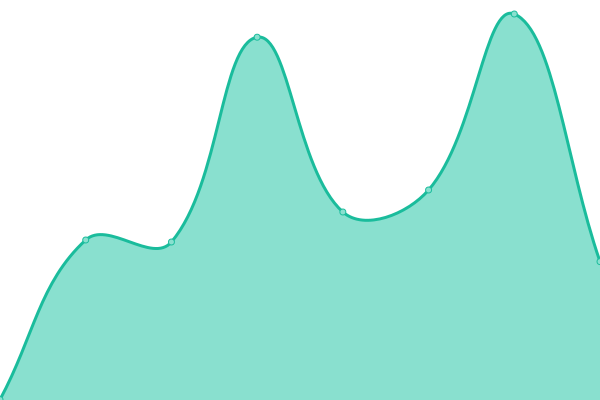
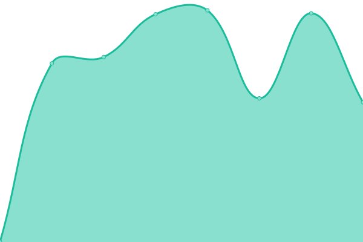

# [📈 Live Status](https://upptime.shinesystems.co.uk): <!--live status--> **🟧 Partial outage**

This repository contains the open-source uptime monitor and status page for [Upptime](https://upptime.js.org), powered by [Upptime](https://github.com/upptime/upptime).

With [Upptime](https://upptime.js.org), you can get your own unlimited and free uptime monitor and status page, powered entirely by a GitHub repository. We use [Issues](https://github.com/upptime/upptime/issues) as incident reports, [Actions](https://github.com/shinesystems/upptime/actions) as uptime monitors, and [Pages](https://upptime.shinesystems.co.uk) for the status page.

<!--start: status pages-->
<!-- This summary is generated by Upptime (https://github.com/upptime/upptime) -->
<!-- Do not edit this manually, your changes will be overwritten -->
<!-- prettier-ignore -->
| URL | Status | History | Response Time | Uptime |
| --- | ------ | ------- | ------------- | ------ |
|  [Shine Systems Web Server](https://shinesystems.co.uk) | 🟥 Down | [shine-systems-web-server.yml](https://github.com/shinesystems/upptime/commits/HEAD/history/shine-systems-web-server.yml) | 

 55ms
     
 | 

<a href="https://upptime.shinesystems.co.uk/history/shine-systems-web-server">0.13%</a>
    

|  [Hosted Email Server](https://mail.shinesystems.co.uk) | 🟩 Up | [hosted-email-server.yml](https://github.com/shinesystems/upptime/commits/HEAD/history/hosted-email-server.yml) | 

 1325ms
     
 | 

<a href="https://upptime.shinesystems.co.uk/history/hosted-email-server">100.00%</a>
    

|  [Email Filtering Appliance](https://efa1.shinesystems.co.uk) | 🟩 Up | [email-filtering-appliance.yml](https://github.com/shinesystems/upptime/commits/HEAD/history/email-filtering-appliance.yml) | 

 518ms
     
 | 

<a href="https://upptime.shinesystems.co.uk/history/email-filtering-appliance">100.00%</a>
    

|  [Internet-UK Email](https://mail.internet-uk.net) | 🟩 Up | [internet-uk-email.yml](https://github.com/shinesystems/upptime/commits/HEAD/history/internet-uk-email.yml) | 

 597ms
     
 | 

<a href="https://upptime.shinesystems.co.uk/history/internet-uk-email">100.00%</a>
    

|  [M0VSE Website](https://m0vse.uk) | 🟩 Up | [m0-vse-website.yml](https://github.com/shinesystems/upptime/commits/HEAD/history/m0-vse-website.yml) | 

 1116ms
     
 | 

<a href="https://upptime.shinesystems.co.uk/history/m0-vse-website">100.00%</a>
    

|  [LRS Website](https://g3lrs.org.uk) | 🟩 Up | [lrs-website.yml](https://github.com/shinesystems/upptime/commits/HEAD/history/lrs-website.yml) | 

 1293ms
     
 | 

<a href="https://upptime.shinesystems.co.uk/history/lrs-website">100.00%</a>
    

|  [LRG Website](https://lrg.org.uk) | 🟩 Up | [lrg-website.yml](https://github.com/shinesystems/upptime/commits/HEAD/history/lrg-website.yml) | 

 1033ms
     
 | 

<a href="https://upptime.shinesystems.co.uk/history/lrg-website">100.00%</a>
    

|  [Falcon Players Website](https://m0vse.uk) | 🟩 Up | [falcon-players-website.yml](https://github.com/shinesystems/upptime/commits/HEAD/history/falcon-players-website.yml) | 

 400ms
     
 | 

<a href="https://upptime.shinesystems.co.uk/history/falcon-players-website">100.00%</a>
    

|  [SPC Website](https://spc-hvac.co.uk) | 🟩 Up | [spc-website.yml](https://github.com/shinesystems/upptime/commits/HEAD/history/spc-website.yml) | 

 3563ms
     
 | 

<a href="https://upptime.shinesystems.co.uk/history/spc-website">100.00%</a>
    

|  [Copperad Website](https://copperad.co.uk) | 🟩 Up | [copperad-website.yml](https://github.com/shinesystems/upptime/commits/HEAD/history/copperad-website.yml) | 

 2641ms
     
 | 

<a href="https://upptime.shinesystems.co.uk/history/copperad-website">100.00%</a>
    

|  [Rosemary Conley Website](https://rosemaryconley.com) | 🟩 Up | [rosemary-conley-website.yml](https://github.com/shinesystems/upptime/commits/HEAD/history/rosemary-conley-website.yml) | 

 1304ms
     
 | 

<a href="https://upptime.shinesystems.co.uk/history/rosemary-conley-website">100.00%</a>
    

|  [Mace Bearer Website](https://macebearer.com) | 🟩 Up | [mace-bearer-website.yml](https://github.com/shinesystems/upptime/commits/HEAD/history/mace-bearer-website.yml) | 

 3504ms
     
 | 

<a href="https://upptime.shinesystems.co.uk/history/mace-bearer-website">100.00%</a>
    

|  [Facial Flex Website](https://facial-flex.co.uk) | 🟩 Up | [facial-flex-website.yml](https://github.com/shinesystems/upptime/commits/HEAD/history/facial-flex-website.yml) | 

 5357ms
     
 | 

<a href="https://upptime.shinesystems.co.uk/history/facial-flex-website">100.00%</a>
    

|  [TP Website](https://total-precision.co.uk) | 🟩 Up | [tp-website.yml](https://github.com/shinesystems/upptime/commits/HEAD/history/tp-website.yml) | 

 828ms
     
 | 

<a href="https://upptime.shinesystems.co.uk/history/tp-website">100.00%</a>
    

<!--end: status pages-->

[**Visit our status website →**](https://upptime.shinesystems.co.uk)

## 📄 License

- Powered by: [Upptime](https://github.com/upptime/upptime)
- Code: [MIT](./LICENSE) © [Anand Chowdhary](https://anandchowdhary.com), supported by [Pabio](https://pabio.com)
- Data in the `./history` directory: [Open Database License](https://opendatacommons.org/licenses/odbl/1-0/)
